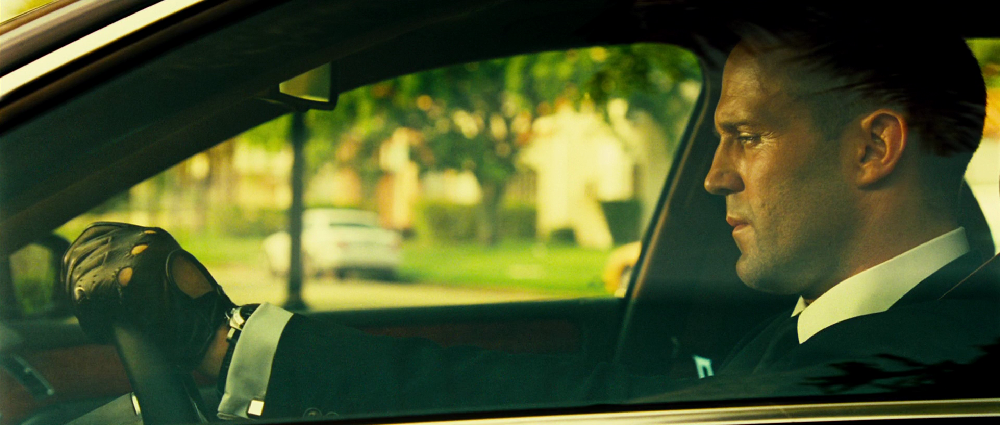

# Project Transporter

This project contains the first website I created back in 2013.
The website has been created during a school project in the computer science course in 10th grade.
It uses plain `HTML` & `CSS`, and just a little bit of `JavaScript`.

## Showcase

 

The homepage with exchangeable backgrounds.

 

A gallery in plain `HTML/CSS` featuring preview images in grayscale, a colored hover effect and a full-size gallery view with descriptions.

 

Information about the first movie of the trilogy.

 

The movie trailer embedded, including options to adjust the background lights.

 

All soundtracks of the first movie embedded and downloadable.

 

Information about the second movie.

 

Information about the third movie.

 

Contact form.
